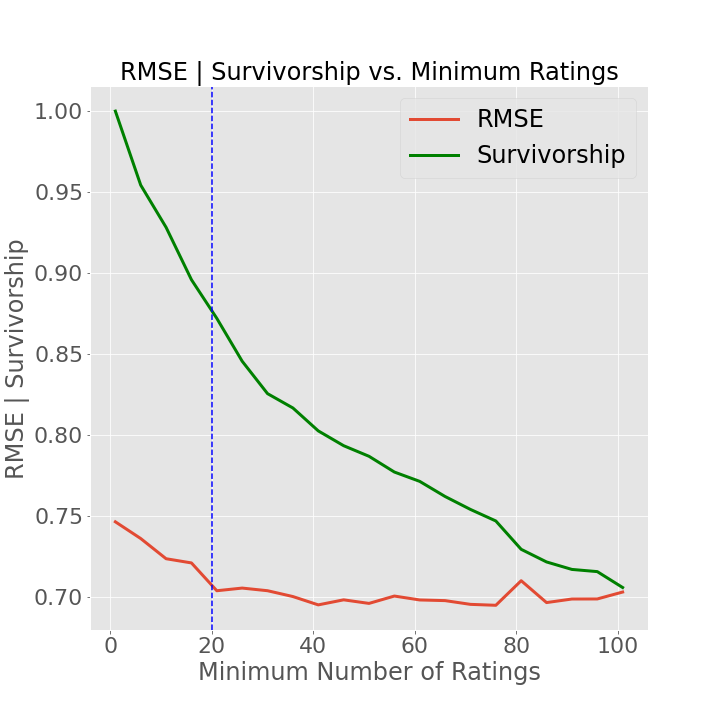

# Rock Climbing Route Recommender

#### Table of Contents
- [Rock Climbing Route Recommender](#rock-climbing-route-recommender)
  * [Motivation](#motivation)
  * [The Data](#the-data)
  * [The Recommendation Engines](#the-recommendation-engines)
    + [Overview](#overview)
    + [Textual Similarity Recommender](#textual-similarity-recommender)
    + [User Similarity Recommender](#user-similarity-recommender)
    + [Route Similarity Recommender](#route-similarity-recommender)
  * [Results](#results)
    + [Textual Similarity Recommender](#textual-similarity-recommender-1)
    + [Matrix Factorization Recommender](#matrix-factorization-recommender)
    + [Route Similarity Recommender](#route-similarity-recommender-1)
    + [Search Functionality](#search-functionality)
  * [Application](#application)
  * [Conclusions](#conclusions)
  * [Future Work](#future-work)

## Motivation
There are many factors to consider when looking for a climb including but not limited to type, difficulty, height,
number of pitches, and quality. Finding a new climb can be a challenge in its own right. Combing through guidebooks
or scouring MountainProject are the methods I have used in the past. If you are only interested in traditional routes
between certain difficulties and near a certain location however, MountainProject's search capabilities, however, leave
much to be desired. This can make finding new rock challenging to find.

I'd say the ideal way to get on new routes is to be recommended a hidden gem, or just something fantastic that you
haven't yet been on. The goal of this project is to provide these recommendations.

## The Data
The data that I used was scraped from MountainProject in June 2021, so data added/updated there after this date will not
be reflected in my dataset. The data consists of nearly 250k routes, 70k users, and 2.7M explicit ratings. The details
regarding how I scraped, cleaned, and exported the data can be found in this
<a href="https://github.com/zsnyder21/MountainProjectScraper" target="_blank" rel="noopener noreferrer">repository</a>.

Routes are rated on a scale from 0 to 4 on MountainProject. Below we see a distribution of route ratings indicating that
most routes are rated favorably.

## The Recommendation Engines
### Overview
Three distinct recommendation engines were created in order to fill in gaps in user coverage and appeal to a wider
variety of of the climbing community.

1) A textual similarity recommendation engine that recommends climbs based on the textual similarity of the
   MountainProject page content or supplied keywords (TF-IDF).
   

2) A matrix factorization recommendation engine that recommends climbs based on the climbs a user has rated.

3) A nearest-neighbors recommendation engine that recommends climbs based on what climbers who have climbed a given
   route also climb (Item Similarity).

### Textual Similarity Recommender
This recommendation engine reads the Description, Protection (if applicable), and Comments sections from MountainProject
and feeds that into a TF-IDF vectorizer with a fixed vocabulary of climbing terms. The similarity score is computed
using cosine similarity and the top results are recommended to the user. There is not really a good metric to score this
type of recommendation engine, without using user input, but we can see below in the results section that the
recommendations at least make sense.

### User Similarity Recommender
This recommendation engine looks at all the routes a user has rated on MountainProject and looks for users that have also
rated some of those climbs and determines what they voted highly that the user in question has not climbed. I opted to
go for a matrix factorization technique and utilized Apache Spark's Alternating Least Squares model to compute user
similarity and estimate user ratings. Here it is important to consider the cold start problem: how many ratings do we
need per climb in order to sufficiently train our model? It is important to note that limiting our dataset to climbs
that have more ratings has an inverse effect on user survivorship: We will lose users from our dataset by filtering in
this fashion. This can be seen in the plot below.

We see that if a rating count threshold of 20 is chosen, we retain nearly 90% of our user base and maintain
a fairly low RMSE. Using this value as a threshold, a gridsearch of hyperparameters was performed. The optimal rank and
regularization parameter was found to be 150 and 0.15 respectively.

### Route Similarity Recommender
This recommendation engine looks at a given route and recommends routes by looking at what users who climbed the given
route have also climbed. This algorithm uses cosine similarity to estimate what each user would rate each route and then
uses a k nearest neighbors approach to determine the k most similar climbs to recommend. Again we consider the cold
start problem. As before we compare survivorship and RMSE to minimum rating count:

Here we see that the rating count again has a reasonable tradeoff of user base vs. RMSE around a threshold of a 20
rating minimum maintain a high user base. We can now grid search for the optimal hyperparameter k. Doing this yields
that k=50 is the ideal number of neighbors to use for this model.

## Results

### Textual Similarity Recommender
As I mentioned above, there is not a good metric to score this recommendation engine. Nonetheless, an example of a
recommendation is as follows:

The input route was 
<a href="https://www.mountainproject.com/route/105874590/separate-reality" target="_blank" rel="noopener noreferrer">Separate Reality</a>,
a steep roof crack in Yosemite Valley, CA. I am interested in routes similar to this in Eldorado Canyon State Park, CO.
One of the top recommendations I was given was
<a href="https://www.mountainproject.com/route/105751180/whiplash" target="_blank" rel="noopener noreferrer">Whiplash</a>.
Both of these climbs ascend roof cracks, indicating that the recommendation engine provides sensible, if not
quantifiable, results. An added bonus of this model is that it is the fastest of the three models to draw predictions
from.

### Matrix Factorization Recommender
The Matrix Factorization recommender gets an RMSE of 0.698. This model is the slowest of the three models. This model is
unfortunately the slowest of the three models to make predictions.

### Route Similarity Recommender
The KNN recommender has an RMSE of 0.675. This model is in between the other two in terms of performance time.

### Search Functionality
Throughout the process of building a data pipeline to source the data into the recommendation engines, a route search
tool was created that (in my opinion) far surpasses the functionality present on MountainProject itself. The filtering
capabilities that this pipeline posesses allows for far more control over what routes you are searching for.

## Application
I took these recommendation systems and deployed them via a Flask application. You can interact with it
<a href="http://3.136.157.114:8080/" target="_blank" rel="noopener noreferrer">here</a> provided it's running
(please email me if it's not). Note that the Matrix Factorization recommender is omitted from this site as the model and
supporting data do not fit on my EC2 instance.

Users are able to search for routes using a variety of filtering criteria:

Users are also able to input criteria to receive recommendations that would match these criteria:

They then receive their top 20 recommendations:

## Conclusions
To sum it all up, I've created three recommendation engines that recommend climbing routes to users in three distinct ways,
and along the way created a robust search tool for finding routes. I then deployed these models into a Flask application
for users to make use of.

## Future Work
Future work includes but is not limited to:

* Ensembling some or all of these recommendation engines together.
* Making use of reinforcement learning by allowing users to indicate whether or not a recommendation is good.